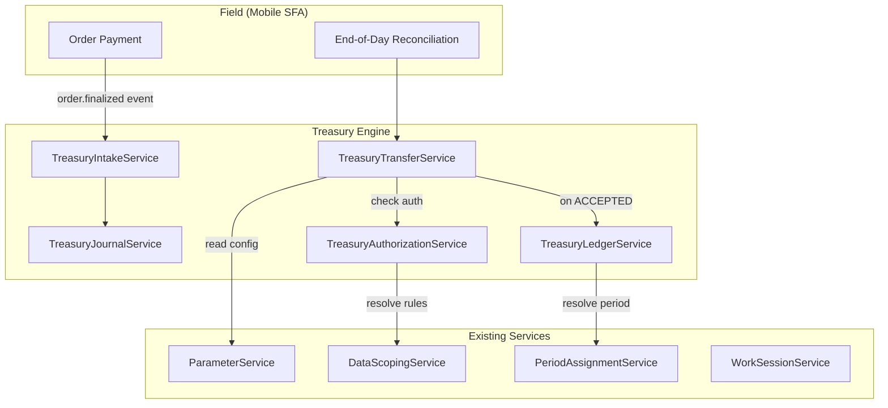
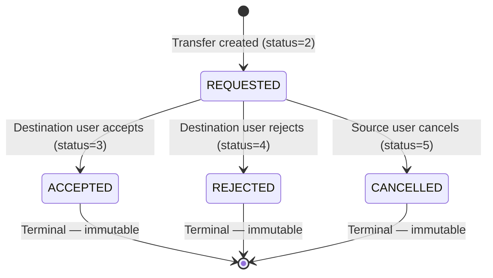
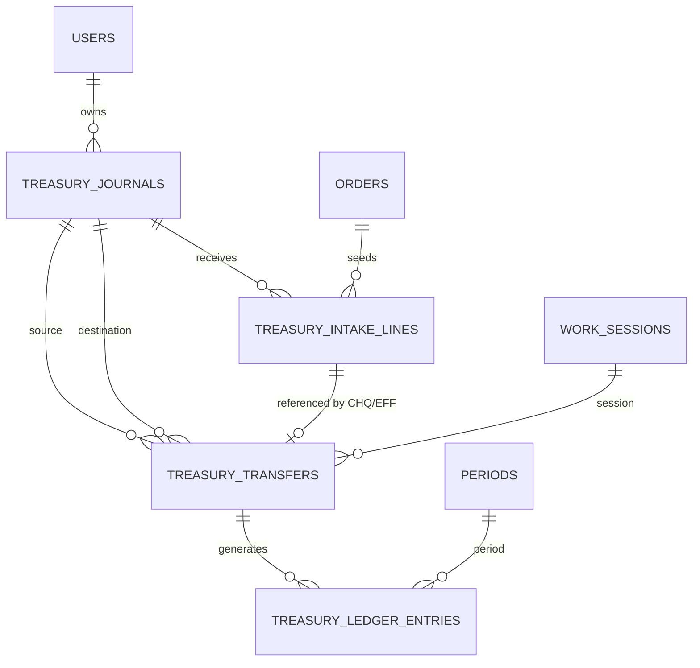

# Treasury Engine — Complete Guide

> **Version**: v1.0 (2026-07)  
> **Services**: `TreasuryJournalService`, `TreasuryTransferService`, `TreasuryAuthorizationService`, `TreasuryLedgerService`, `TreasuryIntakeService`, `TreasuryAuditService`  
> **Architecture**: Journal-based double-entry fund routing with immutable ledger and state-machine workflow

---

## Table of Contents

1. [Architecture Overview](#1-architecture-overview)
2. [Cash Flow Architecture](#2-cash-flow-architecture)
3. [Journal Account System](#3-journal-account-system)
4. [Transfer Workflow State Machine](#4-transfer-workflow-state-machine)
5. [Dual Routing Validation (DIRECT vs BANK_DEPOSIT)](#5-dual-routing-validation-direct-vs-bank_deposit)
6. [Non-Divisibility Rule (CHQ/EFF Paper Instruments)](#6-non-divisibility-rule-chqeff-paper-instruments)
7. [Sage X3 Ledger Schema](#7-sage-x3-ledger-schema)
8. [Authorization via DataScopingService](#8-authorization-via-datascopingservice)
9. [Database Schema](#9-database-schema)
10. [API Reference](#10-api-reference)
11. [Configuration Parameters](#11-configuration-parameters)
12. [Error Codes & Troubleshooting](#12-error-codes--troubleshooting)
13. [SQL Scenarios — Step-by-Step Database Simulation](#13-sql-scenarios--step-by-step-database-simulation)
14. [Admin Finance API — /api/backend/finance/](#14-admin-finance-api--apibackendfinance-2026-07-11)

---

## 1. Architecture Overview

### 1.1 Module Purpose

The Treasury Engine (Trésorerie) manages the movement of collected funds between
field salespersons and the ADV (Administration des Ventes) desk through coded
journal accounts. Every monetary movement is tracked with double-entry consistency
and generates immutable accounting records for Sage X3 export.

### 1.2 High-Level Data Flow



### 1.3 Key Principles

| Principle | Implementation |
|---|---|
| **Double-entry consistency** | Every transfer produces balanced debit/credit entries |
| **Append-only ledger** | No UPDATE/DELETE on intake lines — voids create compensating negatives |
| **Immutable terminal states** | ACCEPTED/REJECTED/CANCELLED transfers are frozen |
| **Dynamic balance computation** | Balance = SUM(incoming) + SUM(intakes) - SUM(outgoing) |
| **Cached balance with self-healing** | `cached_balance` auto-corrects via async job on discrepancy |

---

## 2. Cash Flow Architecture

### 2.1 End-to-End Money Flow Sequence

```
┌──────────────────────────────────────────────────────────────────────────┐
│  PHASE 1: Collection (During Sales Day)                                   │
├──────────────────────────────────────────────────────────────────────────┤
│                                                                            │
│  Order Finalized → event: OrderFinalized                                   │
│       ↓                                                                    │
│  OrderFinalizedListener (queued)                                           │
│       ↓                                                                    │
│  TreasuryIntakeService::seedFromOrder()                                    │
│       ↓                                                                    │
│  Creates Intake_Line (status=ACCEPTED, amount=payment_amount)              │
│       ↓                                                                    │
│  Journal cached_balance incremented                                        │
│                                                                            │
├──────────────────────────────────────────────────────────────────────────┤
│  PHASE 2: End-of-Day Transfer                                              │
├──────────────────────────────────────────────────────────────────────────┤
│                                                                            │
│  Mobile EOD Screen → GET /api/treasury/eod/balances                        │
│       ↓                                                                    │
│  User sees outstanding balances per payment method                         │
│       ↓                                                                    │
│  POST /api/treasury/eod/batch-transfer                                     │
│       ↓                                                                    │
│  TreasuryTransferService::batchTransferForEod()                            │
│       ↓                                                                    │
│  Creates Transfer_Record(s) with status=REQUESTED                          │
│  Transit balance locked on source journal                                  │
│                                                                            │
├──────────────────────────────────────────────────────────────────────────┤
│  PHASE 3: ADV Desk Acceptance                                              │
├──────────────────────────────────────────────────────────────────────────┤
│                                                                            │
│  ADV Operator → POST /api/treasury/transfers/{id}/accept                   │
│       ↓                                                                    │
│  TreasuryTransferService::accept()                                         │
│       ↓                                                                    │
│  Status → ACCEPTED (3)                                                     │
│  Destination journal cached_balance incremented                            │
│  TreasuryLedgerService::generateEntries() → 2 ledger rows                 │
│       ↓                                                                    │
│  Immutable. Ready for Sage X3 export.                                      │
│                                                                            │
└──────────────────────────────────────────────────────────────────────────┘
```

### 2.2 Balance Computation Formula

```
Journal Balance = SUM(accepted incoming transfers)
                + SUM(intake lines — positive and negative)
                - SUM(accepted outgoing transfers)

Available Balance = Journal Balance - Transit Balance

Transit Balance = SUM(amount) WHERE status = REQUESTED AND source_journal = this
```

### 2.3 Work Session Integration

When a salesperson closes their work session (`WorkSessionTransitionService::closeDay()`):

1. `WorkSessionEnding` event dispatched (async)
2. `WorkSessionEndingListener` computes outstanding balances per journal
3. If any journal has positive available balance → session flagged with `treasury_reconciliation_pending: true` in metadata
4. Mobile app shows reconciliation warning before final session close

---

## 3. Journal Account System

### 3.1 Journal Code Pattern

```
C{user_numeric_code}{method_suffix}

Examples:
  C0002ESP  → Salesperson 2, Cash (Espèces)
  C0002CHQ  → Salesperson 2, Chèque
  C0001VER  → ADV Desk 1, Versement (Bank Deposit)
```

### 3.2 Payment Method Suffixes

| Suffix | Payment Method | Description |
|---|---|---|
| `ESP` | Espèces (Cash) | Physical cash collected in field |
| `CHQ` | Chèque | Paper cheque instrument |
| `EFF` | Effet | Commercial paper (bill of exchange) |
| `VIR` | Virement | Bank wire transfer |
| `VER` | Versement | Bank deposit slip (destination only) |

### 3.3 Auto-Creation

Journals are created on-demand via `TreasuryJournalService::findOrCreate()`. When an order is finalized with a payment method the salesperson hasn't used before, the journal is auto-created before seeding the intake line.

---

## 4. Transfer Workflow State Machine



| Status | Code | Who Acts | Effect |
|---|---|---|---|
| RECU | 1 | System | Reserved (legacy) |
| REQUESTED | 2 | Creator | Transit balance locked on source |
| ACCEPTED | 3 | Destination user | Ledger entries generated, dest balance updated |
| REJECTED | 4 | Destination user | Transit released, rejection reason required |
| CANCELLED | 5 | Creator only | Transit released, no other user can cancel |

**Immutability Rule**: Once a transfer reaches ACCEPTED, REJECTED, or CANCELLED — no status change, amount modification, or deletion is permitted.

---

## 5. Dual Routing Validation (DIRECT vs BANK_DEPOSIT)

### 5.1 When Does This Apply?

Only for **ESP (Cash)** transfers. Non-cash methods (CHQ, EFF, VIR) route directly without a `transfer_type` flag.

### 5.2 DIRECT Handover Flow

```
Salesperson hands physical cash to ADV desk operator.

Source:      C0002ESP (Salesperson 2, Cash)
Destination: C0001ESP (ADV Desk 1, Cash)

Validation:
  ✓ transfer_type = 'DIRECT' required
  ✗ No versement_reference needed
  ✗ No photo needed

Ledger (on acceptance):
  DEBIT:  Account 5161 (Caisse) on C0001ESP
  CREDIT: Account 5161 (Caisse) on C0002ESP
```

### 5.3 BANK_DEPOSIT Flow (ESP → VER Conversion)

```
Salesperson deposits cash at bank, submits deposit slip to ADV.

Source:      C0002ESP (Salesperson 2, Cash)
Destination: C0001VER (ADV Desk 1, Versement)  ← suffix converted!

Validation:
  ✓ transfer_type = 'BANK_DEPOSIT' required
  ✓ versement_reference (unique per company, excluding cancelled)
  ✓ versement_photo_path (receipt photo mandatory)
  ○ bank_name (optional)
  ○ deposit_date (used as date_comptable for ledger)

Ledger (on acceptance):
  DEBIT:  Account 5141 (Banque) on C0001VER
  CREDIT: Account 5161 (Caisse) on C0002ESP
```

### 5.4 Journal Conversion Map (CONFIGURATION_JOURNAL)

| Source Suffix | Transfer Type | → Destination Suffix | ParameterService Key |
|---|---|---|---|
| `ESP` | `DIRECT` | `ESP` | `treasury.journal_conversion.ESP.DIRECT` |
| `ESP` | `BANK_DEPOSIT` | `VER` | `treasury.journal_conversion.ESP.BANK_DEPOSIT` |
| `CHQ` | — | `CHQ` | `treasury.journal_conversion.CHQ` |
| `EFF` | — | `EFF` | `treasury.journal_conversion.EFF` |
| `VIR` | — | `VIR` | `treasury.journal_conversion.VIR` |

### 5.5 ADV Desk Journal Resolution

The destination desk journal code is resolved per payment method via ParameterService:

```
treasury.desk_journal.ESP = C0001ESP
treasury.desk_journal.VER = C0001VER
treasury.desk_journal.CHQ = C0001CHQ
treasury.desk_journal.EFF = C0001EFF
treasury.desk_journal.VIR = C0001VIR
```

Per-branch overrides are supported by setting these keys at the Branch level in `configuration_settings`.

---

## 6. Non-Divisibility Rule (CHQ/EFF Paper Instruments)

### 6.1 The Problem

A chèque or effet is a **single, atomic financial paper asset**. If a salesperson collects a chèque for 2,000 MAD, they cannot split it and transfer only 1,000 MAD. The transfer amount must equal the exact face value.

### 6.2 Enforcement Rules

| Rule | Description |
|---|---|
| **No manual amount entry** | For CHQ/EFF, the user selects an Intake_Line by reference — the system pulls the amount automatically |
| **1-to-1 mapping** | Each Transfer_Record maps to exactly one Intake_Line |
| **No partial splits** | Transfer amount must equal Intake_Line amount exactly |
| **No multi-instrument batching** | Cannot group multiple chèques into a single scalar transfer |
| **Uniqueness guard** | Database partial unique index ensures one active transfer per intake line |

### 6.3 Database Enforcement

```sql
-- Partial unique index: one active transfer per intake line
CREATE UNIQUE INDEX idx_tt_intake_line_active
    ON treasury_transfers(intake_line_id)
    WHERE intake_line_id IS NOT NULL AND status NOT IN (5);
```

### 6.4 Validation Pipeline (in TreasuryTransferService::createTransfer)

```php
// For CHQ/EFF transfers:
1. intake_line_id is REQUIRED in $options
2. Intake line must exist AND belong to the source journal
3. Intake line must NOT already be linked to another active transfer
   → throws IntakeAlreadyTransferredException
4. Transfer amount must equal intake line amount EXACTLY
   → throws PaperInstrumentMismatchException
```

### 6.5 EOD Batch Behavior for Paper Instruments

When `batchTransferForEod()` processes CHQ/EFF journals:
- Iterates over **individual pending intake lines** (not aggregated balance)
- Creates **one Transfer_Record per Intake_Line**
- Each transfer references its `intake_line_id` with the exact face value
- Idempotency key: `work_session_id + intake_line_id`

---

## 7. Sage X3 Ledger Schema

### 7.1 Overview

Every accepted transfer automatically generates a balanced double-entry ledger record using Plan Comptable Marocain (Moroccan Chart of Accounts) codes. These records are **immutable** — no UPDATE or DELETE permitted.

### 7.2 Compte Comptable Mapping

| Journal Suffix | Compte Comptable | Account Name (PCM) |
|---|---|---|
| `ESP` | `5161` | Caisse |
| `CHQ` | `5113` | Chèques à encaisser |
| `EFF` | `3425` | Effets à recevoir |
| `VER` | `5141` | Banque |
| `VIR` | `5141` | Banque |

Configurable via ParameterService keys: `treasury.account.{SUFFIX}`

### 7.3 Ledger Generation Rules per Transfer Type

| Transfer | Debit Account | Debit Journal | Credit Account | Credit Journal |
|---|---|---|---|---|
| ESP DIRECT (ESP→ESP) | 5161 (Caisse) | Dest (ADV desk) | 5161 (Caisse) | Source (salesperson) |
| ESP BANK_DEPOSIT (ESP→VER) | 5141 (Banque) | Dest (ADV desk) | 5161 (Caisse) | Source (salesperson) |
| CHQ (CHQ→CHQ) | 5113 (Chèques) | Dest (ADV desk) | 5113 (Chèques) | Source (salesperson) |
| EFF (EFF→EFF) | 3425 (Effets) | Dest (ADV desk) | 3425 (Effets) | Source (salesperson) |
| VIR (VIR→VIR) | 5141 (Banque) | Dest (ADV desk) | 5141 (Banque) | Source (salesperson) |

### 7.4 The `date_comptable` Rule

The accounting date on ledger entries uses the **bank statement date**, not the system timestamp:

```
IF transfer.deposit_date IS NOT NULL:
    date_comptable = deposit_date  (actual bank deposit date)
ELSE:
    date_comptable = accepted_at::date  (acceptance timestamp as date)
```

This ensures month-end financial exports match bank reconciliation statements exactly.

### 7.5 Ledger Entry Schema

```sql
treasury_ledger_entries (
    id              BIGSERIAL PRIMARY KEY,
    company_id      BIGINT NOT NULL,
    transfer_id     BIGINT NOT NULL → treasury_transfers(id),
    journal_code    VARCHAR(20) NOT NULL,      -- e.g. C0001VER
    compte_comptable VARCHAR(10) NOT NULL,     -- e.g. 5141
    debit_amount    DECIMAL(15,2) DEFAULT 0,   -- one side only
    credit_amount   DECIMAL(15,2) DEFAULT 0,   -- one side only
    date_comptable  DATE NOT NULL,             -- bank statement date
    libelle         VARCHAR(255) NOT NULL,     -- description
    period_id       BIGINT NOT NULL → periods(id),
    created_at      TIMESTAMP NOT NULL
)

-- Invariant: (debit > 0 AND credit = 0) OR (credit > 0 AND debit = 0)
-- Invariant: SUM(debit) = SUM(credit) for every transfer_id pair
```

### 7.6 Querying for Sage X3 Export

```sql
-- Export all ledger entries for a given period
SELECT
    tle.journal_code,
    tle.compte_comptable,
    tle.debit_amount,
    tle.credit_amount,
    tle.date_comptable,
    tle.libelle,
    p.code AS period_code
FROM treasury_ledger_entries tle
JOIN periods p ON p.id = tle.period_id
WHERE tle.period_id = :period_id
  AND tle.company_id = :company_id
ORDER BY tle.date_comptable, tle.id;
```

**API Endpoint**: `GET /api/treasury/ledger?period_id=X&company_id=Y`

---

## 8. Authorization via DataScopingService

### 8.1 Transfer Route Model

The system uses `treasury_transfer_routes` to define valid source→destination suffix pairs:

| Route ID | Source | Dest | Description |
|---|---|---|---|
| 1 | ESP | ESP | Cash direct handover |
| 2 | ESP | VER | Cash to bank deposit |
| 3 | CHQ | CHQ | Cheque transfer |
| 4 | EFF | EFF | Effet transfer |
| 5 | VIR | VIR | Virement transfer |

### 8.2 Authorization Resolution

```
1. Extract source_suffix and dest_suffix from the transfer request
2. Find matching TreasuryTransferRoute row
3. Query data_rules for that route's model_id using 5-level cascade:
   User → Partner → Role → Profile → Branch
4. If winning rule = 'allow' → proceed
5. If winning rule = 'deny' or no rule → reject (403)
```

Every authorization check (allowed and denied) is logged to `treasury_audit_logs`.

---

## 9. Database Schema

### 9.1 Entity Relationship



### 9.2 Tables Summary

| Table | Purpose | Key Constraints |
|---|---|---|
| `treasury_journals` | User × payment method fund buckets | UNIQUE(code, company_id), UNIQUE(user_id, method_suffix, company_id) |
| `treasury_transfers` | Fund movement records with state machine | CHECK(status IN 1-5), CHECK(amount > 0), CHECK(source != dest) |
| `treasury_intake_lines` | Auto-seeded payment entries (append-only) | CHECK(status = 3), negative amounts for voids |
| `treasury_ledger_entries` | Immutable double-entry accounting records | CHECK(debit XOR credit), no UPDATE/DELETE |
| `treasury_transfer_routes` | Valid source→dest suffix pairs for auth | UNIQUE(source_suffix, dest_suffix, company_id) |
| `treasury_audit_logs` | Immutable operation audit trail | No UPDATE/DELETE, JSONB metadata |

---

## 10. API Reference

### 10.1 Endpoints

| Method | Path | Description |
|---|---|---|
| `GET` | `/api/treasury/journals` | List user journals (grouped by payment method) |
| `GET` | `/api/treasury/journals/{id}` | Get journal details with computed balance |
| `GET` | `/api/treasury/journals/{id}/balance` | Get balance breakdown |
| `POST` | `/api/treasury/transfers` | Create a transfer |
| `GET` | `/api/treasury/transfers` | List transfers (filterable) |
| `POST` | `/api/treasury/transfers/{id}/accept` | Accept a transfer |
| `POST` | `/api/treasury/transfers/{id}/reject` | Reject a transfer (reason required) |
| `POST` | `/api/treasury/transfers/{id}/cancel` | Cancel a transfer (creator only) |
| `GET` | `/api/treasury/eod/balances` | Get EOD balances for reconciliation |
| `POST` | `/api/treasury/eod/batch-transfer` | Batch transfer for EOD clearing |
| `GET` | `/api/treasury/ledger` | Query ledger entries (Sage X3 export) |
| `GET` | `/api/treasury/audit` | Query audit trail |

All endpoints require `auth:sanctum` authentication.

### 10.2 Create Transfer Request Body

```json
{
  "source_journal_id": 5,
  "dest_journal_id": 1,
  "amount": 3500.00,
  "transfer_type": "BANK_DEPOSIT",
  "versement_reference": "VER-2026-07-001",
  "versement_photo_path": "/uploads/versements/ver-001.jpg",
  "bank_name": "Attijariwafa Bank",
  "deposit_date": "2026-07-03",
  "intake_line_id": null,
  "note": "EOD cash deposit"
}
```

### 10.3 Error Response Format

```json
{
  "message": "Solde disponible insuffisant pour ce transfert",
  "error": {
    "code": "TREASURY_INSUFFICIENT_BALANCE",
    "message": "Solde disponible insuffisant pour ce transfert",
    "details": {
      "journal_code": "C0002ESP",
      "available_balance": 1500.00,
      "requested_amount": 2000.00
    }
  }
}
```

---

## 11. Configuration Parameters

All parameters are stored in `configuration_settings` via ParameterService. Changes apply immediately without restart.

| Key | Type | Default | Description |
|---|---|---|---|
| `treasury.default_currency` | string | `MAD` | Default currency for new journals |
| `treasury.allow_negative_balance` | boolean | `false` | Allow journal balances to go negative |
| `treasury.transfer.max_amount` | decimal | `0` | Max transfer amount (0 = no limit) |
| `treasury.transfer.min_amount` | decimal | `0` | Min transfer amount (0 = no minimum) |
| `treasury.journal_conversion.ESP.DIRECT` | string | `ESP` | ESP direct → dest suffix |
| `treasury.journal_conversion.ESP.BANK_DEPOSIT` | string | `VER` | ESP bank deposit → dest suffix |
| `treasury.journal_conversion.CHQ` | string | `CHQ` | CHQ → dest suffix |
| `treasury.journal_conversion.EFF` | string | `EFF` | EFF → dest suffix |
| `treasury.journal_conversion.VIR` | string | `VIR` | VIR → dest suffix |
| `treasury.desk_journal.*` | string | `C0001{SUFFIX}` | ADV desk journal codes |
| `treasury.account.ESP` | string | `5161` | Compte comptable: Caisse |
| `treasury.account.CHQ` | string | `5113` | Compte comptable: Chèques à encaisser |
| `treasury.account.EFF` | string | `3425` | Compte comptable: Effets à recevoir |
| `treasury.account.VER` | string | `5141` | Compte comptable: Banque |
| `treasury.account.VIR` | string | `5141` | Compte comptable: Banque |

---

## 12. Error Codes & Troubleshooting

| Code | HTTP | Cause | Resolution |
|---|---|---|---|
| `TREASURY_INSUFFICIENT_BALANCE` | 422 | Available balance < transfer amount | Wait for pending transfers to clear or reduce amount |
| `TREASURY_TRANSFER_UNAUTHORIZED` | 403 | No ALLOW rule for journal pair | Configure data_rules for the user's role |
| `TREASURY_INVALID_TRANSITION` | 422 | Invalid state machine transition | Only REQUESTED transfers can be accepted/rejected/cancelled |
| `TREASURY_TRANSFER_IMMUTABLE` | 422 | Mutation on terminal transfer | ACCEPTED/REJECTED/CANCELLED transfers cannot be changed |
| `TREASURY_AMOUNT_EXCEEDS_MAX` | 422 | Amount > configured maximum | Reduce amount or increase `treasury.transfer.max_amount` |
| `TREASURY_AMOUNT_BELOW_MIN` | 422 | Amount < configured minimum | Increase amount or lower `treasury.transfer.min_amount` |
| `TREASURY_VERSEMENT_REQUIRED` | 422 | BANK_DEPOSIT without reference/photo | Provide `versement_reference` and `versement_photo_path` |
| `TREASURY_VERSEMENT_DUPLICATE` | 422 | Versement reference already used | Use a unique deposit slip reference |
| `TREASURY_CANCEL_NOT_CREATOR` | 403 | Non-creator attempting cancellation | Only the original creator can cancel |
| `TREASURY_REJECTION_REASON_REQUIRED` | 422 | Rejection without reason | Provide a `reason` string |
| `TREASURY_NEGATIVE_BALANCE_BLOCKED` | 422 | Would cause negative balance | Enable `treasury.allow_negative_balance` or add funds |
| `TREASURY_PAPER_INSTRUMENT_MISMATCH` | 422 | CHQ/EFF amount ≠ intake line amount | Amount must match the paper instrument face value exactly |
| `TREASURY_INTAKE_ALREADY_TRANSFERRED` | 422 | Intake line already linked to active transfer | That chèque/effet has already been transferred |
| `TREASURY_PERIOD_CLOSED` | 422 | Operation in closed accounting period | Reopen the period or use the current one |


---

## 13. SQL Scenarios — Step-by-Step Database Simulation

> These scenarios simulate exactly what happens in the database at each step of the treasury lifecycle. Run them in order to understand the full flow.

---

### Scenario 1: Full Day — Cash Collection → DIRECT Handover → Acceptance

**Context**: Salesperson Ahmed (user_id=2, code='0002') collects 3 cash payments during the day, then transfers all cash directly to ADV desk at EOD.

#### Step 1.1 — Journal auto-created on first order

```sql
-- When Ahmed's first order is finalized, the system auto-creates his ESP journal
INSERT INTO treasury_journals (company_id, user_id, code, method_suffix, currency, cached_balance, is_active)
VALUES (1, 2, 'C0002ESP', 'ESP', 'MAD', 0.00, TRUE);
-- Result: journal id=5
```

#### Step 1.2 — Three orders finalized during the day

```sql
-- Order #101: Client pays 1,500 MAD cash
INSERT INTO treasury_intake_lines (company_id, journal_id, order_id, amount, status, payment_method, created_by)
VALUES (1, 5, 101, 1500.00, 3, 'ESP', 2);

UPDATE treasury_journals SET cached_balance = cached_balance + 1500.00 WHERE id = 5;
-- cached_balance = 1500.00

-- Order #102: Client pays 2,200 MAD cash
INSERT INTO treasury_intake_lines (company_id, journal_id, order_id, amount, status, payment_method, created_by)
VALUES (1, 5, 102, 2200.00, 3, 'ESP', 2);

UPDATE treasury_journals SET cached_balance = cached_balance + 2200.00 WHERE id = 5;
-- cached_balance = 3700.00

-- Order #103: Client pays 800 MAD cash
INSERT INTO treasury_intake_lines (company_id, journal_id, order_id, amount, status, payment_method, created_by)
VALUES (1, 5, 103, 800.00, 3, 'ESP', 2);

UPDATE treasury_journals SET cached_balance = cached_balance + 800.00 WHERE id = 5;
-- cached_balance = 4500.00
```

#### Step 1.3 — Verify Ahmed's balance at EOD

```sql
-- Dynamic computation (source of truth)
SELECT
    (SELECT COALESCE(SUM(amount), 0) FROM treasury_intake_lines WHERE journal_id = 5)
    -
    (SELECT COALESCE(SUM(amount), 0) FROM treasury_transfers WHERE source_journal_id = 5 AND status = 3)
    +
    (SELECT COALESCE(SUM(amount), 0) FROM treasury_transfers WHERE dest_journal_id = 5 AND status = 3)
    AS computed_balance;
-- Result: 4500.00

-- Transit balance (pending outgoing)
SELECT COALESCE(SUM(amount), 0) AS transit_balance
FROM treasury_transfers
WHERE source_journal_id = 5 AND status = 2;
-- Result: 0.00 (no pending transfers yet)

-- Available = 4500.00 - 0.00 = 4500.00
```

#### Step 1.4 — Ahmed creates DIRECT transfer to ADV desk

```sql
-- ADV desk ESP journal (pre-existing)
-- treasury_journals: id=1, code='C0001ESP', user_id=1, method_suffix='ESP'

-- Transfer created: 4500 MAD from C0002ESP → C0001ESP
INSERT INTO treasury_transfers (
    company_id, source_journal_id, dest_journal_id, amount, currency,
    status, transfer_type, created_by, work_session_id
)
VALUES (1, 5, 1, 4500.00, 'MAD', 2, 'DIRECT', 2, 10);
-- Result: transfer id=20, status=REQUESTED(2)

-- Transit balance is now locked (computed dynamically, no column update needed)
-- Available = 4500.00 - 4500.00 = 0.00
```

#### Step 1.5 — Verify transit lock

```sql
SELECT COALESCE(SUM(amount), 0) AS transit_balance
FROM treasury_transfers
WHERE source_journal_id = 5 AND status = 2;
-- Result: 4500.00 (locked!)

-- Ahmed cannot create another transfer (available = 0)
```

#### Step 1.6 — ADV desk operator accepts the transfer

```sql
-- ADV operator (user_id=1) accepts transfer #20
UPDATE treasury_transfers
SET status = 3,
    accepted_by = 1,
    accepted_at = NOW()
WHERE id = 20;

-- Destination journal balance updated
UPDATE treasury_journals SET cached_balance = cached_balance + 4500.00 WHERE id = 1;
-- ADV desk C0001ESP cached_balance = 4500.00

-- Ledger entries generated (immutable)
INSERT INTO treasury_ledger_entries
    (company_id, transfer_id, journal_code, compte_comptable, debit_amount, credit_amount, date_comptable, libelle, period_id)
VALUES
    (1, 20, 'C0001ESP', '5161', 4500.00, 0.00, CURRENT_DATE, 'Transfert C0002ESP → C0001ESP - 4500.00 MAD', 6),
    (1, 20, 'C0002ESP', '5161', 0.00, 4500.00, CURRENT_DATE, 'Transfert C0002ESP → C0001ESP - 4500.00 MAD', 6);

-- Audit log
INSERT INTO treasury_audit_logs (company_id, operation_type, journal_code, transfer_id, user_id, amount, previous_state, new_state, metadata)
VALUES (1, 'STATUS_CHANGED', 'C0002ESP', 20, 1, 4500.00, 'REQUESTED', 'ACCEPTED', '{}');
```

#### Step 1.7 — Final state verification

```sql
-- Ahmed's journal: balance should be 0 (all transferred out)
SELECT
    (SELECT COALESCE(SUM(amount), 0) FROM treasury_intake_lines WHERE journal_id = 5)
    -
    (SELECT COALESCE(SUM(amount), 0) FROM treasury_transfers WHERE source_journal_id = 5 AND status = 3)
    AS balance;
-- Result: 4500.00 - 4500.00 = 0.00 ✓

-- ADV desk journal: received 4500
SELECT cached_balance FROM treasury_journals WHERE id = 1;
-- Result: 4500.00 ✓

-- Ledger is balanced
SELECT
    SUM(debit_amount) AS total_debit,
    SUM(credit_amount) AS total_credit
FROM treasury_ledger_entries
WHERE transfer_id = 20;
-- Result: total_debit=4500.00, total_credit=4500.00 ✓
```

---

### Scenario 2: BANK_DEPOSIT — Cash Deposited at Bank (ESP → VER Conversion)

**Context**: Salesperson Karim (user_id=3, code='0003') collected 6,000 MAD cash and deposits it at the bank instead of handing it directly to ADV.

#### Step 2.1 — Karim's journal with collected cash

```sql
-- Karim's ESP journal: id=7, code='C0003ESP', cached_balance=6000.00
-- (Intake lines already created from orders during the day)

SELECT cached_balance FROM treasury_journals WHERE id = 7;
-- Result: 6000.00
```

#### Step 2.2 — Karim creates BANK_DEPOSIT transfer

```sql
-- Note: destination is C0001VER (not C0001ESP!) — suffix converted from ESP to VER
INSERT INTO treasury_transfers (
    company_id, source_journal_id, dest_journal_id, amount, currency,
    status, transfer_type,
    versement_reference, versement_photo_path, bank_name, deposit_date,
    created_by, work_session_id
)
VALUES (
    1, 7, 2, 6000.00, 'MAD',
    2, 'BANK_DEPOSIT',
    'VER-2026-07-003', '/uploads/versements/karim-003.jpg', 'Attijariwafa Bank', '2026-07-03',
    3, 12
);
-- Result: transfer id=21, status=REQUESTED(2)
-- dest_journal_id=2 → treasury_journals WHERE code='C0001VER'
```

#### Step 2.3 — ADV operator verifies bank slip and accepts

```sql
-- ADV sees the bank slip photo and reference, verifies against bank statement
UPDATE treasury_transfers
SET status = 3,
    accepted_by = 1,
    accepted_at = NOW()
WHERE id = 21;

-- Destination VER journal balance updated
UPDATE treasury_journals SET cached_balance = cached_balance + 6000.00 WHERE id = 2;

-- Ledger entries: DEBIT 5141 (Banque) on VER, CREDIT 5161 (Caisse) on ESP
INSERT INTO treasury_ledger_entries
    (company_id, transfer_id, journal_code, compte_comptable, debit_amount, credit_amount, date_comptable, libelle, period_id)
VALUES
    -- DEBIT: Banque (5141) on destination VER journal
    (1, 21, 'C0001VER', '5141', 6000.00, 0.00, '2026-07-03', 'Transfert C0003ESP → C0001VER - 6000.00 MAD', 6),
    -- CREDIT: Caisse (5161) on source ESP journal
    (1, 21, 'C0003ESP', '5161', 0.00, 6000.00, '2026-07-03', 'Transfert C0003ESP → C0001VER - 6000.00 MAD', 6);

-- NOTE: date_comptable = '2026-07-03' (deposit_date, NOT system timestamp!)
```

#### Step 2.4 — Compare DIRECT vs BANK_DEPOSIT ledger entries

```sql
-- DIRECT (Scenario 1): Both entries use compte 5161 (Caisse ↔ Caisse)
SELECT journal_code, compte_comptable, debit_amount, credit_amount
FROM treasury_ledger_entries WHERE transfer_id = 20;
-- C0001ESP | 5161 | 4500.00 | 0.00    (ADV desk receives cash)
-- C0002ESP | 5161 | 0.00    | 4500.00 (Salesperson gives cash)

-- BANK_DEPOSIT (Scenario 2): Debit uses 5141 (Banque), Credit uses 5161 (Caisse)
SELECT journal_code, compte_comptable, debit_amount, credit_amount
FROM treasury_ledger_entries WHERE transfer_id = 21;
-- C0001VER | 5141 | 6000.00 | 0.00    (Bank account credited)
-- C0003ESP | 5161 | 0.00    | 6000.00 (Salesperson's cash deducted)
```

---

### Scenario 3: CHQ Paper Instrument — Non-Divisibility Enforcement

**Context**: Salesperson Youssef (user_id=4, code='0004') collected 2 cheques: one for 2,000 MAD and one for 3,500 MAD. He must transfer each cheque individually at its exact face value.

#### Step 3.1 — Youssef's CHQ journal with 2 cheques

```sql
-- Youssef's CHQ journal: id=9, code='C0004CHQ'
-- Two intake lines from two orders with cheque payments

INSERT INTO treasury_intake_lines (id, company_id, journal_id, order_id, amount, status, payment_method, created_by)
VALUES
    (50, 1, 9, 201, 2000.00, 3, 'CHQ', 4),  -- Cheque #1: 2,000 MAD
    (51, 1, 9, 202, 3500.00, 3, 'CHQ', 4);  -- Cheque #2: 3,500 MAD

UPDATE treasury_journals SET cached_balance = 5500.00 WHERE id = 9;
```

#### Step 3.2 — ❌ BLOCKED: Attempt to transfer partial amount

```sql
-- Youssef tries to transfer 1,000 MAD (splitting cheque #1)
-- This is REJECTED by the system!

-- The validation checks:
-- 1. method_suffix = 'CHQ' → paper instrument rules apply
-- 2. intake_line_id is required → must select a specific cheque
-- 3. amount (1000) != intake_line.amount (2000) → MISMATCH!

-- Error: TREASURY_PAPER_INSTRUMENT_MISMATCH
-- "Transfer amount 1000.00 does not match intake line #50 face value 2000.00"
```

#### Step 3.3 — ❌ BLOCKED: Attempt to batch both cheques into one transfer

```sql
-- Youssef tries to create one transfer for 5,500 MAD (both cheques combined)
-- This is REJECTED!

-- The validation checks:
-- 1. method_suffix = 'CHQ' → paper instrument rules apply
-- 2. intake_line_id must reference exactly ONE intake line
-- 3. amount (5500) != any single intake_line.amount → MISMATCH!

-- Error: TREASURY_PAPER_INSTRUMENT_MISMATCH
```

#### Step 3.4 — ✓ CORRECT: Transfer cheque #1 at exact face value

```sql
-- Transfer cheque #1: exactly 2,000 MAD, referencing intake_line_id=50
INSERT INTO treasury_transfers (
    company_id, source_journal_id, dest_journal_id, amount, currency,
    status, transfer_type, intake_line_id, created_by, work_session_id
)
VALUES (1, 9, 3, 2000.00, 'MAD', 2, NULL, 50, 4, 15);
-- Result: transfer id=30, status=REQUESTED(2)
-- Note: transfer_type is NULL for CHQ (not needed)
-- Note: intake_line_id=50 links to the specific cheque

-- Verify the partial unique index prevents double-transfer:
SELECT * FROM treasury_transfers
WHERE intake_line_id = 50 AND status NOT IN (5);
-- Returns 1 row → intake line #50 is now "locked"
```

#### Step 3.5 — ✓ CORRECT: Transfer cheque #2 at exact face value

```sql
-- Transfer cheque #2: exactly 3,500 MAD, referencing intake_line_id=51
INSERT INTO treasury_transfers (
    company_id, source_journal_id, dest_journal_id, amount, currency,
    status, transfer_type, intake_line_id, created_by, work_session_id
)
VALUES (1, 9, 3, 3500.00, 'MAD', 2, NULL, 51, 4, 15);
-- Result: transfer id=31, status=REQUESTED(2)
```

#### Step 3.6 — ❌ BLOCKED: Attempt to re-transfer cheque #1

```sql
-- Someone tries to create another transfer for intake_line_id=50
-- BLOCKED by partial unique index idx_tt_intake_line_active!

-- Error: TREASURY_INTAKE_ALREADY_TRANSFERRED
-- "Intake line #50 is already linked to active transfer #30"

-- The only way to "free" it: cancel transfer #30 (status → 5)
-- Then the WHERE clause (status NOT IN (5)) excludes it from the unique index
```

#### Step 3.7 — ADV accepts both cheques

```sql
-- Accept cheque #1
UPDATE treasury_transfers SET status = 3, accepted_by = 1, accepted_at = NOW() WHERE id = 30;
UPDATE treasury_journals SET cached_balance = cached_balance + 2000.00 WHERE id = 3; -- C0001CHQ

INSERT INTO treasury_ledger_entries
    (company_id, transfer_id, journal_code, compte_comptable, debit_amount, credit_amount, date_comptable, libelle, period_id)
VALUES
    (1, 30, 'C0001CHQ', '5113', 2000.00, 0.00, CURRENT_DATE, 'Transfert C0004CHQ → C0001CHQ - 2000.00 MAD', 6),
    (1, 30, 'C0004CHQ', '5113', 0.00, 2000.00, CURRENT_DATE, 'Transfert C0004CHQ → C0001CHQ - 2000.00 MAD', 6);

-- Accept cheque #2
UPDATE treasury_transfers SET status = 3, accepted_by = 1, accepted_at = NOW() WHERE id = 31;
UPDATE treasury_journals SET cached_balance = cached_balance + 3500.00 WHERE id = 3;

INSERT INTO treasury_ledger_entries
    (company_id, transfer_id, journal_code, compte_comptable, debit_amount, credit_amount, date_comptable, libelle, period_id)
VALUES
    (1, 31, 'C0001CHQ', '5113', 3500.00, 0.00, CURRENT_DATE, 'Transfert C0004CHQ → C0001CHQ - 3500.00 MAD', 6),
    (1, 31, 'C0004CHQ', '5113', 0.00, 3500.00, CURRENT_DATE, 'Transfert C0004CHQ → C0001CHQ - 3500.00 MAD', 6);
```

---

### Scenario 4: Transfer Rejection and Cancellation

**Context**: Demonstrates what happens to the database when transfers are rejected or cancelled.

#### Step 4.1 — Transfer created and then REJECTED by ADV

```sql
-- Salesperson creates transfer: 1,200 MAD
INSERT INTO treasury_transfers (
    company_id, source_journal_id, dest_journal_id, amount, currency,
    status, transfer_type, created_by
)
VALUES (1, 5, 1, 1200.00, 'MAD', 2, 'DIRECT', 2);
-- Result: transfer id=40, status=REQUESTED(2)

-- Transit balance on source journal:
SELECT SUM(amount) FROM treasury_transfers WHERE source_journal_id = 5 AND status = 2;
-- Result: 1200.00 (locked)

-- ADV rejects (physical cash count doesn't match)
UPDATE treasury_transfers
SET status = 4,
    rejected_by = 1,
    rejected_at = NOW(),
    rejection_reason = 'Montant physique ne correspond pas - manque 200 MAD'
WHERE id = 40;

-- Transit balance AUTOMATICALLY released (status no longer = 2)
SELECT SUM(amount) FROM treasury_transfers WHERE source_journal_id = 5 AND status = 2;
-- Result: 0.00 (released!)

-- NO ledger entries generated (only on acceptance)
SELECT COUNT(*) FROM treasury_ledger_entries WHERE transfer_id = 40;
-- Result: 0

-- Audit trail records the rejection
INSERT INTO treasury_audit_logs (company_id, operation_type, transfer_id, user_id, amount, previous_state, new_state, metadata)
VALUES (1, 'STATUS_CHANGED', 40, 1, 1200.00, 'REQUESTED', 'REJECTED',
    '{"rejection_reason": "Montant physique ne correspond pas - manque 200 MAD"}');
```

#### Step 4.2 — Transfer created and then CANCELLED by salesperson

```sql
-- Ahmed creates transfer but realizes he made a mistake
INSERT INTO treasury_transfers (
    company_id, source_journal_id, dest_journal_id, amount, currency,
    status, transfer_type, created_by
)
VALUES (1, 5, 1, 999.00, 'MAD', 2, 'DIRECT', 2);
-- Result: transfer id=41, status=REQUESTED(2)

-- Ahmed cancels it himself (only creator can cancel!)
UPDATE treasury_transfers
SET status = 5,
    cancelled_by = 2,
    cancelled_at = NOW()
WHERE id = 41;

-- Transit released, no ledger entries, balance unchanged
-- If another user (user_id=3) tried to cancel → TREASURY_CANCEL_NOT_CREATOR error
```

#### Step 4.3 — ❌ BLOCKED: Attempt to cancel an ACCEPTED transfer

```sql
-- Transfer #20 was already accepted (status=3)
-- Any attempt to change it is blocked:

-- UPDATE treasury_transfers SET status = 5 WHERE id = 20;
-- Error: TREASURY_TRANSFER_IMMUTABLE
-- "Transfer #20 is in terminal state ACCEPTED and cannot be modified"
```

---

### Scenario 5: Payment Void — Compensating Negative Intake Line

**Context**: Order #101 payment (1,500 MAD) is voided after the intake line was already created.

#### Step 5.1 — Original intake line exists

```sql
SELECT id, journal_id, order_id, amount, payment_method
FROM treasury_intake_lines
WHERE order_id = 101;
-- Result: id=1, journal_id=5, amount=1500.00, payment_method='ESP'
```

#### Step 5.2 — Void creates compensating NEGATIVE entry

```sql
-- System creates a negative intake line (original is NEVER modified/deleted)
INSERT INTO treasury_intake_lines (company_id, journal_id, order_id, amount, status, payment_method, note, created_by)
VALUES (1, 5, 101, -1500.00, 3, 'ESP', 'Payment voided: client returned goods', 1);
-- Result: id=100, amount=-1500.00

-- Journal balance decremented
UPDATE treasury_journals SET cached_balance = cached_balance - 1500.00 WHERE id = 5;

-- Verify: original entry is UNTOUCHED
SELECT id, amount FROM treasury_intake_lines WHERE order_id = 101 ORDER BY id;
-- id=1,   amount= 1500.00  (original — still there!)
-- id=100, amount=-1500.00  (compensating void)

-- Net effect on balance: 1500 + (-1500) = 0.00 ✓
```

---

### Scenario 6: Concurrent Transfers — Multiple REQUESTED from Same Journal

**Context**: Ahmed has 10,000 MAD balance and creates 3 transfers before any are accepted.

#### Step 6.1 — Starting state

```sql
-- Ahmed's ESP journal: id=5, computed_balance=10000.00, transit=0.00
-- Available = 10000.00
```

#### Step 6.2 — Three concurrent REQUESTED transfers

```sql
-- Transfer A: 3,000 MAD
INSERT INTO treasury_transfers (company_id, source_journal_id, dest_journal_id, amount, status, transfer_type, created_by)
VALUES (1, 5, 1, 3000.00, 2, 'DIRECT', 2);
-- Available after: 10000 - 3000 = 7000

-- Transfer B: 4,000 MAD
INSERT INTO treasury_transfers (company_id, source_journal_id, dest_journal_id, amount, status, transfer_type, created_by)
VALUES (1, 5, 1, 4000.00, 2, 'DIRECT', 2);
-- Available after: 10000 - 3000 - 4000 = 3000

-- Transfer C: 3,000 MAD
INSERT INTO treasury_transfers (company_id, source_journal_id, dest_journal_id, amount, status, transfer_type, created_by)
VALUES (1, 5, 1, 3000.00, 2, 'DIRECT', 2);
-- Available after: 10000 - 3000 - 4000 - 3000 = 0

-- ❌ Transfer D: 1 MAD — BLOCKED!
-- Available = 0, cannot create any more transfers
-- Error: TREASURY_INSUFFICIENT_BALANCE
```

#### Step 6.3 — Verify dynamic transit computation

```sql
SELECT
    (SELECT COALESCE(SUM(amount), 0) FROM treasury_intake_lines WHERE journal_id = 5) AS total_intakes,
    (SELECT COALESCE(SUM(amount), 0) FROM treasury_transfers WHERE source_journal_id = 5 AND status = 2) AS transit_balance,
    (SELECT COALESCE(SUM(amount), 0) FROM treasury_intake_lines WHERE journal_id = 5)
    - (SELECT COALESCE(SUM(amount), 0) FROM treasury_transfers WHERE source_journal_id = 5 AND status = 3)
    - (SELECT COALESCE(SUM(amount), 0) FROM treasury_transfers WHERE source_journal_id = 5 AND status = 2)
    AS available_balance;
-- total_intakes=10000, transit_balance=10000, available_balance=0
```

#### Step 6.4 — Rejecting one transfer frees up balance

```sql
-- ADV rejects Transfer B (4,000 MAD)
UPDATE treasury_transfers SET status = 4, rejected_by = 1, rejected_at = NOW(),
    rejection_reason = 'Montant incorrect' WHERE id = 43; -- Transfer B

-- Transit recalculated dynamically:
SELECT SUM(amount) FROM treasury_transfers WHERE source_journal_id = 5 AND status = 2;
-- Result: 6000.00 (only A + C remain as REQUESTED)

-- Available = 10000 - 6000 = 4000 MAD → Ahmed can now create new transfers!
```

---

### Scenario 7: EOD Batch Transfer — Mixed Payment Methods

**Context**: Salesperson Fatima (user_id=5) has balances in ESP, CHQ, and EFF journals at end-of-day.

#### Step 7.1 — Fatima's journals at EOD

```sql
SELECT id, code, method_suffix, cached_balance
FROM treasury_journals
WHERE user_id = 5 AND is_active = TRUE;
-- id=10, C0005ESP, ESP, 8000.00  (cash from multiple orders)
-- id=11, C0005CHQ, CHQ, 5500.00  (2 cheques: 2000 + 3500)
-- id=12, C0005EFF, EFF, 4000.00  (1 effet: 4000)
```

#### Step 7.2 — Batch transfer creates DIFFERENT behavior per method

```sql
-- ESP: ONE transfer for the full available balance
INSERT INTO treasury_transfers (company_id, source_journal_id, dest_journal_id, amount, status, transfer_type, created_by)
VALUES (1, 10, 1, 8000.00, 2, 'DIRECT', 5);
-- 1 transfer for all cash

-- CHQ: ONE transfer PER cheque (non-divisibility!)
-- First, find untransferred intake lines:
SELECT id, amount FROM treasury_intake_lines
WHERE journal_id = 11 AND amount > 0
AND id NOT IN (SELECT intake_line_id FROM treasury_transfers WHERE intake_line_id IS NOT NULL AND status != 5);
-- id=60, amount=2000.00
-- id=61, amount=3500.00

INSERT INTO treasury_transfers (company_id, source_journal_id, dest_journal_id, amount, status, intake_line_id, created_by)
VALUES
    (1, 11, 3, 2000.00, 2, 60, 5),  -- Cheque #1
    (1, 11, 3, 3500.00, 2, 61, 5);  -- Cheque #2
-- 2 transfers, one per cheque!

-- EFF: ONE transfer PER effet (non-divisibility!)
SELECT id, amount FROM treasury_intake_lines
WHERE journal_id = 12 AND amount > 0
AND id NOT IN (SELECT intake_line_id FROM treasury_transfers WHERE intake_line_id IS NOT NULL AND status != 5);
-- id=70, amount=4000.00

INSERT INTO treasury_transfers (company_id, source_journal_id, dest_journal_id, amount, status, intake_line_id, created_by)
VALUES (1, 12, 4, 4000.00, 2, 70, 5);  -- Effet #1
-- 1 transfer for the single effet

-- TOTAL: 4 transfers created (1 ESP + 2 CHQ + 1 EFF)
```

#### Step 7.3 — Summary comparison

```sql
-- Count transfers per method for this batch:
SELECT
    tj.method_suffix,
    COUNT(*) AS transfer_count,
    SUM(tt.amount) AS total_amount
FROM treasury_transfers tt
JOIN treasury_journals tj ON tj.id = tt.source_journal_id
WHERE tt.created_by = 5 AND tt.work_session_id = 20
GROUP BY tj.method_suffix;

-- method_suffix | transfer_count | total_amount
-- ESP           | 1              | 8000.00    ← aggregated balance
-- CHQ           | 2              | 5500.00    ← one per cheque
-- EFF           | 1              | 4000.00    ← one per effet
```

---

### Scenario 8: Full Audit Trail Query

```sql
-- Reconstruct complete history of transfer #20
SELECT
    operation_type,
    user_id,
    amount,
    previous_state,
    new_state,
    created_at,
    metadata
FROM treasury_audit_logs
WHERE transfer_id = 20
ORDER BY created_at;

-- Result:
-- TRANSFER_CREATED | 2 | 4500.00 | NULL      | REQUESTED | 2026-07-03 17:30:00
-- STATUS_CHANGED   | 1 | 4500.00 | REQUESTED | ACCEPTED  | 2026-07-03 18:15:00

-- Query all operations for a specific journal in a date range
SELECT operation_type, amount, new_state, created_at
FROM treasury_audit_logs
WHERE journal_code = 'C0002ESP'
  AND created_at BETWEEN '2026-07-03' AND '2026-07-04'
ORDER BY created_at;
```


---

### Scenario 9: Vendeur Conventionnel — Multi-Partner Collection → Bank Deposit → ADV Approval

**Context réel**:
- **Vendeur**: Omar (user_id=6, code='0006') — vendeur conventionnel (camion)
- **Jour J**: Omar collecte du cash chez 2 clients
  - CL00012 → 1,500 MAD (espèces)
  - CL00013 → 2,200 MAD (espèces)
- **Jour J+1**: Omar dépose le total (3,700 MAD) à la banque, obtient un reçu de versement
- **Jour J+1**: Omar soumet le transfert BANK_DEPOSIT vers ADV
- **ADV Meriam** (user_id=8) approuve le transfert
- **Comptable Hatim** (user_id=9) consulte les écritures comptables pour export Sage X3

---

#### Flux visuel complet

```
┌─────────────────────────────────────────────────────────────────────────────────┐
│                           JOUR J — Collecte terrain                               │
├─────────────────────────────────────────────────────────────────────────────────┤
│                                                                                   │
│  CL00012 ──── Commande #301 ──── Paiement ESP 1,500 MAD                         │
│       │                                                                           │
│       └──→ event: OrderFinalized                                                  │
│            └──→ TreasuryIntakeService::seedFromOrder()                            │
│                 └──→ Intake_Line #80 (journal C0006ESP, +1500, status=ACCEPTED)   │
│                                                                                   │
│  CL00013 ──── Commande #302 ──── Paiement ESP 2,200 MAD                         │
│       │                                                                           │
│       └──→ event: OrderFinalized                                                  │
│            └──→ TreasuryIntakeService::seedFromOrder()                            │
│                 └──→ Intake_Line #81 (journal C0006ESP, +2200, status=ACCEPTED)   │
│                                                                                   │
│  ═══════════════════════════════════════════════════════════════════════════════   │
│  Solde journal C0006ESP à fin de journée: 3,700.00 MAD                           │
│                                                                                   │
├─────────────────────────────────────────────────────────────────────────────────┤
│                     JOUR J+1 — Dépôt bancaire + Transfert                         │
├─────────────────────────────────────────────────────────────────────────────────┤
│                                                                                   │
│  Omar va à la banque (Attijariwafa) ──→ Dépose 3,700 MAD                         │
│       │                                                                           │
│       └──→ Reçoit bordereau: REF "VER-2026-07-045"                               │
│            Photo du reçu: /uploads/versements/omar-045.jpg                        │
│            Date dépôt bancaire: 2026-07-04                                        │
│                                                                                   │
│  Omar ouvre l'app mobile ──→ POST /api/treasury/transfers                         │
│       │                                                                           │
│       └──→ TreasuryTransferService::createTransfer()                             │
│            ├── Source: C0006ESP (Omar, Cash)                                      │
│            ├── Dest:   C0001VER (ADV Desk, Versement) ← conversion ESP→VER       │
│            ├── Amount: 3,700.00 MAD                                               │
│            ├── Type:   BANK_DEPOSIT                                               │
│            ├── Ref:    VER-2026-07-045                                            │
│            └── Status: REQUESTED (2) — transit verrouillé                         │
│                                                                                   │
├─────────────────────────────────────────────────────────────────────────────────┤
│                     JOUR J+1 — ADV Meriam approuve                                │
├─────────────────────────────────────────────────────────────────────────────────┤
│                                                                                   │
│  Meriam (ADV) ──→ Voit le transfert entrant sur son écran                        │
│       │           Vérifie: photo du bordereau + référence VER-2026-07-045         │
│       │           Compare avec le relevé bancaire de la société                   │
│       │                                                                           │
│       └──→ POST /api/treasury/transfers/{id}/accept                              │
│            └──→ TreasuryTransferService::accept()                                │
│                 ├── Status: REQUESTED → ACCEPTED (3)                              │
│                 ├── Dest journal C0001VER: +3,700.00                              │
│                 └── TreasuryLedgerService::generateEntries()                     │
│                      ├── DEBIT:  5141 (Banque) sur C0001VER — 3,700.00           │
│                      └── CREDIT: 5161 (Caisse) sur C0006ESP — 3,700.00           │
│                      └── date_comptable = 2026-07-04 (date dépôt bancaire!)      │
│                                                                                   │
├─────────────────────────────────────────────────────────────────────────────────┤
│                     Comptable Hatim — Export Sage X3                               │
├─────────────────────────────────────────────────────────────────────────────────┤
│                                                                                   │
│  Hatim ──→ GET /api/treasury/ledger?period_id=6&compte_comptable=5141            │
│       │                                                                           │
│       └──→ Résultat:                                                             │
│            ┌──────────┬────────────────┬───────┬────────┬────────────┐           │
│            │ journal  │ compte_compta  │ débit │ crédit │ date_compt │           │
│            ├──────────┼────────────────┼───────┼────────┼────────────┤           │
│            │ C0001VER │ 5141           │ 3700  │ 0      │ 2026-07-04 │           │
│            └──────────┴────────────────┴───────┴────────┴────────────┘           │
│                                                                                   │
│  Hatim ──→ GET /api/treasury/ledger?period_id=6&compte_comptable=5161            │
│       │                                                                           │
│       └──→ Résultat:                                                             │
│            ┌──────────┬────────────────┬───────┬────────┬────────────┐           │
│            │ journal  │ compte_compta  │ débit │ crédit │ date_compt │           │
│            ├──────────┼────────────────┼───────┼────────┼────────────┤           │
│            │ C0006ESP │ 5161           │ 0     │ 3700   │ 2026-07-04 │           │
│            └──────────┴────────────────┴───────┴────────┴────────────┘           │
│                                                                                   │
│  → Prêt pour import Sage X3 (SUM débit = SUM crédit = 3700.00) ✓                │
│                                                                                   │
└─────────────────────────────────────────────────────────────────────────────────┘
```

---

#### SQL pas-à-pas — Ce qui se passe exactement dans la base

##### JOUR J — 10h00: Omar livre CL00012, encaisse 1,500 MAD

```sql
-- Auto-création du journal ESP d'Omar (si premier encaissement)
INSERT INTO treasury_journals (id, company_id, user_id, code, method_suffix, currency, cached_balance, is_active)
VALUES (15, 1, 6, 'C0006ESP', 'ESP', 'MAD', 0.00, TRUE);

-- Commande #301 finalisée → Intake Line créée automatiquement
INSERT INTO treasury_intake_lines (id, company_id, journal_id, order_id, amount, status, payment_method, created_by)
VALUES (80, 1, 15, 301, 1500.00, 3, 'ESP', 6);

-- Mise à jour du solde caché
UPDATE treasury_journals SET cached_balance = 1500.00 WHERE id = 15;

-- Audit
INSERT INTO treasury_audit_logs (company_id, operation_type, journal_code, user_id, amount, new_state, metadata)
VALUES (1, 'INTAKE_CREATED', 'C0006ESP', 6, 1500.00, 'ACCEPTED',
    '{"intake_line_id": 80, "order_id": 301, "payment_method": "ESP"}');
```

##### JOUR J — 14h00: Omar livre CL00013, encaisse 2,200 MAD

```sql
-- Commande #302 finalisée → Intake Line créée
INSERT INTO treasury_intake_lines (id, company_id, journal_id, order_id, amount, status, payment_method, created_by)
VALUES (81, 1, 15, 302, 2200.00, 3, 'ESP', 6);

-- Solde mis à jour
UPDATE treasury_journals SET cached_balance = 3700.00 WHERE id = 15;

-- Audit
INSERT INTO treasury_audit_logs (company_id, operation_type, journal_code, user_id, amount, new_state, metadata)
VALUES (1, 'INTAKE_CREATED', 'C0006ESP', 6, 2200.00, 'ACCEPTED',
    '{"intake_line_id": 81, "order_id": 302, "payment_method": "ESP"}');
```

##### JOUR J — 17h30: Fin de session — Vérification solde

```sql
-- L'app mobile appelle GET /api/treasury/eod/balances
-- Le système calcule:

SELECT
    tj.code,
    tj.method_suffix,
    tj.cached_balance,
    COALESCE(SUM(CASE WHEN tt.status = 2 THEN tt.amount END), 0) AS transit_balance,
    tj.cached_balance - COALESCE(SUM(CASE WHEN tt.status = 2 THEN tt.amount END), 0) AS available_balance
FROM treasury_journals tj
LEFT JOIN treasury_transfers tt ON tt.source_journal_id = tj.id
WHERE tj.user_id = 6 AND tj.is_active = TRUE
GROUP BY tj.id;

-- Résultat:
-- code     | method | cached  | transit | available
-- C0006ESP | ESP    | 3700.00 | 0.00    | 3700.00   ← à transférer!

-- Session flaggée: treasury_reconciliation_pending = true
```

##### JOUR J+1 — 09h00: Omar dépose 3,700 MAD à la banque

```sql
-- Omar crée le transfert BANK_DEPOSIT via l'app mobile
-- POST /api/treasury/transfers

-- Vérifications effectuées par le système:
-- 1. ✓ Authorization: Omar a le droit ESP→VER (data_rules, route_id=2)
-- 2. ✓ Amount thresholds: 3700 dans les limites
-- 3. ✓ transfer_type = 'BANK_DEPOSIT' (obligatoire pour ESP)
-- 4. ✓ versement_reference = 'VER-2026-07-045' (unique dans la company)
-- 5. ✓ versement_photo_path fourni
-- 6. ✓ Available balance: 3700 >= 3700

INSERT INTO treasury_transfers (
    id, company_id, source_journal_id, dest_journal_id,
    amount, currency, status, transfer_type,
    versement_reference, versement_photo_path, bank_name, deposit_date,
    created_by, work_session_id
)
VALUES (
    50, 1, 15, 2,
    3700.00, 'MAD', 2, 'BANK_DEPOSIT',
    'VER-2026-07-045', '/uploads/versements/omar-045.jpg', 'Attijariwafa Bank', '2026-07-04',
    6, 25
);
-- Status = REQUESTED (2)
-- dest_journal_id = 2 → C0001VER (journal Versement du desk ADV)
-- Transit verrouillé: available = 3700 - 3700 = 0

-- Audit
INSERT INTO treasury_audit_logs (company_id, operation_type, journal_code, transfer_id, user_id, amount, new_state, metadata)
VALUES (1, 'TRANSFER_CREATED', 'C0006ESP', 50, 6, 3700.00, 'REQUESTED',
    '{"source": "C0006ESP", "dest": "C0001VER", "transfer_type": "BANK_DEPOSIT", "versement_ref": "VER-2026-07-045"}');
```

##### JOUR J+1 — 11h00: ADV Meriam approuve le transfert

```sql
-- Meriam voit le transfert entrant sur son écran ADV
-- Elle vérifie:
--   • Photo du bordereau bancaire ✓
--   • Référence VER-2026-07-045 correspond au relevé ✓
--   • Montant 3,700 MAD correspond ✓

-- POST /api/treasury/transfers/50/accept
UPDATE treasury_transfers
SET status = 3,
    accepted_by = 8,
    accepted_at = '2026-07-04 11:00:00'
WHERE id = 50;

-- Journal destination (C0001VER) crédité
UPDATE treasury_journals SET cached_balance = cached_balance + 3700.00 WHERE id = 2;

-- Écritures comptables générées (IMMUTABLES)
INSERT INTO treasury_ledger_entries
    (id, company_id, transfer_id, journal_code, compte_comptable, debit_amount, credit_amount, date_comptable, libelle, period_id)
VALUES
    -- DÉBIT: Banque (5141) sur le journal VER du desk
    (100, 1, 50, 'C0001VER', '5141', 3700.00, 0.00, '2026-07-04',
     'Transfert C0006ESP → C0001VER - 3700.00 MAD', 6),
    -- CRÉDIT: Caisse (5161) sur le journal ESP d'Omar
    (101, 1, 50, 'C0006ESP', '5161', 0.00, 3700.00, '2026-07-04',
     'Transfert C0006ESP → C0001VER - 3700.00 MAD', 6);

-- IMPORTANT: date_comptable = '2026-07-04' = deposit_date (date du relevé bancaire)
-- PAS la date système! Ceci garantit la concordance avec le rapprochement bancaire.

-- Audit
INSERT INTO treasury_audit_logs (company_id, operation_type, journal_code, transfer_id, user_id, amount, previous_state, new_state, metadata)
VALUES (1, 'STATUS_CHANGED', 'C0006ESP', 50, 8, 3700.00, 'REQUESTED', 'ACCEPTED',
    '{"accepted_by": "Meriam (ADV)", "user_id": 8}');
```

##### JOUR J+1 — 15h00: Comptable Hatim exporte vers Sage X3

```sql
-- Hatim consulte les écritures pour la période comptable
-- GET /api/treasury/ledger?period_id=6&date_from=2026-07-04&date_to=2026-07-04

SELECT
    tle.id,
    tle.journal_code,
    tle.compte_comptable,
    tle.debit_amount,
    tle.credit_amount,
    tle.date_comptable,
    tle.libelle,
    tt.versement_reference,
    tt.transfer_type
FROM treasury_ledger_entries tle
JOIN treasury_transfers tt ON tt.id = tle.transfer_id
WHERE tle.period_id = 6
  AND tle.date_comptable = '2026-07-04'
ORDER BY tle.id;

-- Résultat pour Sage X3:
-- ┌─────┬──────────┬────────┬───────┬────────┬────────────┬─────────────────────────────────────────┬─────────────────┐
-- │ id  │ journal  │ compte │ débit │ crédit │ date_compt │ libellé                                 │ ref_versement   │
-- ├─────┼──────────┼────────┼───────┼────────┼────────────┼─────────────────────────────────────────┼─────────────────┤
-- │ 100 │ C0001VER │ 5141   │ 3700  │ 0      │ 2026-07-04 │ Transfert C0006ESP → C0001VER - 3700 MAD│ VER-2026-07-045 │
-- │ 101 │ C0006ESP │ 5161   │ 0     │ 3700   │ 2026-07-04 │ Transfert C0006ESP → C0001VER - 3700 MAD│ VER-2026-07-045 │
-- └─────┴──────────┴────────┴───────┴────────┴────────────┴─────────────────────────────────────────┴─────────────────┘

-- Vérification double-entry:
SELECT
    SUM(debit_amount) AS total_debit,
    SUM(credit_amount) AS total_credit,
    SUM(debit_amount) - SUM(credit_amount) AS balance_check
FROM treasury_ledger_entries
WHERE transfer_id = 50;
-- total_debit=3700.00, total_credit=3700.00, balance_check=0.00 ✓
```

##### État final des journaux

```sql
SELECT
    tj.code,
    tj.method_suffix,
    tj.cached_balance,
    u.name AS owner
FROM treasury_journals tj
JOIN users u ON u.id = tj.user_id
WHERE tj.code IN ('C0006ESP', 'C0001VER')
ORDER BY tj.code;

-- ┌──────────┬────────┬─────────────────┬───────────────────┐
-- │ code     │ method │ cached_balance  │ owner             │
-- ├──────────┼────────┼─────────────────┼───────────────────┤
-- │ C0001VER │ VER    │ 3700.00         │ ADV Desk (Meriam) │
-- │ C0006ESP │ ESP    │ 3700.00 (caché) │ Omar              │
-- └──────────┴────────┴─────────────────┴───────────────────┘

-- Note: Le cached_balance d'Omar reste à 3700 car il reflète les intake_lines.
-- Mais son solde RÉEL (dynamique) est 0:

SELECT
    (SELECT SUM(amount) FROM treasury_intake_lines WHERE journal_id = 15) AS intakes,
    (SELECT SUM(amount) FROM treasury_transfers WHERE source_journal_id = 15 AND status = 3) AS outgoing_accepted,
    (SELECT SUM(amount) FROM treasury_intake_lines WHERE journal_id = 15)
    - (SELECT SUM(amount) FROM treasury_transfers WHERE source_journal_id = 15 AND status = 3)
    AS solde_reel;

-- intakes=3700, outgoing_accepted=3700, solde_reel=0.00 ✓
-- Omar a tout transféré. Son portefeuille terrain est vide.
```

##### Trace d'audit complète de cette opération

```sql
SELECT
    operation_type,
    journal_code,
    user_id,
    amount,
    previous_state,
    new_state,
    created_at
FROM treasury_audit_logs
WHERE transfer_id = 50 OR (journal_code = 'C0006ESP' AND created_at >= '2026-07-03')
ORDER BY created_at;

-- ┌──────────────────┬──────────┬─────────┬─────────┬───────────┬───────────┬─────────────────────┐
-- │ operation        │ journal  │ user_id │ amount  │ prev      │ new       │ timestamp           │
-- ├──────────────────┼──────────┼─────────┼─────────┼───────────┼───────────┼─────────────────────┤
-- │ INTAKE_CREATED   │ C0006ESP │ 6       │ 1500.00 │ NULL      │ ACCEPTED  │ 2026-07-03 10:00:00 │
-- │ INTAKE_CREATED   │ C0006ESP │ 6       │ 2200.00 │ NULL      │ ACCEPTED  │ 2026-07-03 14:00:00 │
-- │ TRANSFER_CREATED │ C0006ESP │ 6       │ 3700.00 │ NULL      │ REQUESTED │ 2026-07-04 09:00:00 │
-- │ STATUS_CHANGED   │ C0006ESP │ 8       │ 3700.00 │ REQUESTED │ ACCEPTED  │ 2026-07-04 11:00:00 │
-- └──────────────────┴──────────┴─────────┴─────────┴───────────┴───────────┴─────────────────────┘
-- Traçabilité 100%: qui, quand, combien, d'où vers où.
```

---

## 14. Admin Finance API — `/api/backend/finance/` (2026-07-11)

> **Audience :** équipe UI (écrans d'administration Finance)
> **Rôles :** `root` | `admin` | `adv_agent` (caissier)
> **Auth :** `Authorization: Bearer {token}` — réponses `{ success, data, message? }`
>
> Ces endpoints sont le **pilotage admin** du moteur décrit dans ce document. Ils
> réutilisent les mêmes services (`TreasuryJournalService`, `TreasuryTransferService`…) :
> tous les invariants des sections 4-8 (state machine, non-divisibilité, routes
> autorisées, double-partie) s'appliquent à l'identique.

### 14.1 Journals — Caisses & Comptes

#### `GET /api/backend/finance/journals`

| Param | Type | Description |
|---|---|---|
| `branch_id` | int | Via le propriétaire du journal (users.branch_id) |
| `user_id` | int | Journaux d'un utilisateur |
| `method_suffix` | string | ESP, CHQ, EFF, VIR, VER |
| `active_only` | bool | Actifs uniquement |
| `search` | string | Recherche sur le code |
| `per_page` | int | Défaut 20 |

```json
{
  "success": true,
  "data": {
    "current_page": 1,
    "data": [
      {
        "id": 5,
        "code": "C0002ESP",
        "method_suffix": "ESP",
        "currency": "MAD",
        "cached_balance": "4500.00",
        "is_active": true,
        "user": { "id": 2, "name": "Ahmed Vendeur", "code": "0002", "branch_id": 3 },
        "computed_balance": 4500.00,
        "transit_balance": 1200.00,
        "available_balance": 3300.00
      }
    ],
    "total": 14
  }
}
```

> **UI :** affichez les 3 soldes. `computed_balance` = source de vérité,
> `transit_balance` = fonds bloqués en attente d'approbation, `available` = utilisable.
> Ne jamais afficher `cached_balance` seul (il peut être en cours d'auto-correction).

#### `POST /api/backend/finance/journals`

```json
// Requête
{ "user_id": 2, "method_suffix": "ESP", "branch_id": 3 }

// 201 (créé) ou 200 (existait déjà — idempotent)
{
  "success": true,
  "message": "Journal created.",
  "data": { "id": 5, "code": "C0002ESP", "method_suffix": "ESP", "is_active": true }
}

// 422 — le user n'appartient pas à la branche donnée
{
  "success": false,
  "error_code": "FINANCE_BRANCH_MISMATCH",
  "message": "The journal owner does not belong to the given branch. Attach the desk user to the branch first."
}
```

> Le `code` est **auto-généré** (`C{code_user}{SUFFIXE}`) — champ read-only dans le formulaire.
> `branch_id` est un guard de cohérence : le rattachement branche passe par l'utilisateur desk.

#### `PUT /api/backend/finance/journals/{id}`

```json
// Requête (seuls champs éditables)
{ "is_active": false, "currency": "MAD" }

// 422 — GUARD : désactivation bloquée si solde calculé > 0
{
  "success": false,
  "error_code": "FINANCE_JOURNAL_HAS_BALANCE",
  "message": "Cannot deactivate journal C0002ESP: computed balance is 4 500.00 MAD. Transfer the funds out first.",
  "details": { "journal_code": "C0002ESP", "computed_balance": 4500.00 }
}

// 422 — GUARD : fonds en transit (transferts REQUESTED en attente)
{
  "success": false,
  "error_code": "FINANCE_JOURNAL_HAS_TRANSIT",
  "message": "Cannot deactivate journal C0002ESP: 1 200.00 MAD are pending in transit. Accept or cancel the pending transfers first.",
  "details": { "journal_code": "C0002ESP", "transit_balance": 1200.00 }
}
```

> `code`, `user_id`, `method_suffix`, `cached_balance` ne sont **pas** éditables (identité comptable).

### 14.2 Grand Livre — lecture + contre-écriture

#### `GET /api/backend/finance/ledger`

| Param | Type | Description |
|---|---|---|
| `from_date` / `to_date` | date | Sur `date_comptable` |
| `journal_code` | string | ex. C0001VER |
| `type` | `IN` \| `OUT` | IN = débit (entrée), OUT = crédit (sortie) |
| `compte_comptable` | string | ex. 5161 |
| `transfer_id` / `period_id` | int | |

```json
{
  "success": true,
  "data": {
    "data": [
      {
        "id": 101,
        "transfer_id": 50,
        "journal_code": "C0001VER",
        "compte_comptable": "5141",
        "debit_amount": "3700.00",
        "credit_amount": "0.00",
        "date_comptable": "2026-07-04",
        "libelle": "Transfert C0006ESP → C0001VER - 3700.00 MAD",
        "period": { "id": 6, "code": "2026-07" }
      }
    ],
    "total": 240
  },
  "totals": { "total_debit": 152300.00, "total_credit": 152300.00 }
}
```

> **UI :** `totals` porte sur le **filtre courant** (pas la page) → footer de tableau.
> **Aucun bouton Éditer/Supprimer** : le ledger est immuable (aucune route PUT/DELETE
> n'existe, et le modèle lui-même refuse update/delete). Seule action : contre-écriture.

#### `POST /api/backend/finance/ledger/{entryId}/adjust`

Contre-écriture compensatoire : crée la paire **miroir** (débit↔crédit inversés sur
les mêmes journaux/comptes) — l'original n'est **jamais** modifié.

```json
// Requête — reason OBLIGATOIRE
{ "reason": "Montant erroné suite double comptage caisse", "date_comptable": "2026-07-11" }

// 201
{
  "success": true,
  "message": "Compensating entries posted. The original entries remain untouched.",
  "data": [
    { "id": 210, "journal_code": "C0001VER", "compte_comptable": "5141",
      "debit_amount": "0.00", "credit_amount": "3700.00",
      "libelle": "[CONTRE-ÉCRITURE #100] Montant erroné suite double comptage caisse — Transfert C0006ESP → C0001VER - 3700.00 MAD" },
    { "id": 211, "journal_code": "C0006ESP", "compte_comptable": "5161",
      "debit_amount": "3700.00", "credit_amount": "0.00",
      "libelle": "[CONTRE-ÉCRITURE #101] ..." }
  ]
}

// 422 — déjà compensé (une seule contre-écriture par transfert)
{ "success": false, "error_code": "FINANCE_LEDGER_ALREADY_COMPENSATED",
  "message": "This transfer has already been compensated. A second reversal is not allowed." }

// 422 — période comptable fermée
{ "success": false, "error_code": "FINANCE_PERIOD_CLOSED", "message": "..." }
```

> **UI :** badge visuel sur les libellés préfixés `[CONTRE-ÉCRITURE #…]`.
> Modal de confirmation avec champ raison requis. Audit automatique (`LEDGER_COMPENSATION`).

### 14.3 Transferts de fonds — demande + approbation

#### `GET /api/backend/finance/transfers`

Filtres : `status` (2=REQUESTED, 3=ACCEPTED, 4=REJECTED, 5=CANCELLED), `journal_code`
(source OU destination), `source_journal_id`, `dest_journal_id`, `created_by`, `from_date`, `to_date`.

#### `POST /api/backend/finance/transfers`

```json
// Cash direct (remise en main propre)
{ "source_journal_id": 5, "dest_journal_id": 1, "amount": 4500.00,
  "transfer_type": "DIRECT", "note": "Remise fin de tournée" }

// Cash déposé en banque — référence + photo OBLIGATOIRES
{ "source_journal_id": 5, "dest_journal_id": 2, "amount": 6000.00,
  "transfer_type": "BANK_DEPOSIT",
  "versement_reference": "VER-2026-07-045",
  "versement_photo_path": "/uploads/versements/v45.jpg",
  "bank_name": "Attijariwafa Bank", "deposit_date": "2026-07-11" }

// Chèque — montant = valeur faciale EXACTE, intake_line_id REQUIS
{ "source_journal_id": 9, "dest_journal_id": 3, "amount": 2000.00, "intake_line_id": 50 }

// 201
{
  "success": true,
  "message": "Transfer requested. Funds locked in transit until approval.",
  "data": { "id": 60, "status": 2, "amount": "4500.00",
    "sourceJournal": { "id": 5, "code": "C0002ESP" },
    "destJournal": { "id": 1, "code": "C0001ESP" } }
}

// 422 — solde insuffisant (details exploitables pour le message UI)
{ "success": false,
  "error": { "code": "TREASURY_INSUFFICIENT_BALANCE",
    "details": { "journal_code": "C0002ESP", "available_balance": 3300.00, "requested_amount": 4500.00 } },
  "message": "Solde disponible insuffisant pour ce transfert" }
```

> **UI formulaire :** si journal source `ESP` → select `transfer_type` (DIRECT/BANK_DEPOSIT) ;
> BANK_DEPOSIT révèle référence + upload photo. Si `CHQ`/`EFF` → sélection d'un
> chèque/effet (intake line), montant **read-only** (non-divisibilité, §6).

#### `POST /api/backend/finance/transfers/{id}/approve`

```json
// Requête — confirmed_amount = comptage physique (optionnel, trace l'écart)
{ "comment": "Espèces comptées et vérifiées", "confirmed_amount": 4500.00 }

// 200 — soldes mis à jour + double-partie générée automatiquement
{
  "success": true,
  "message": "Transfer approved — balances updated and double-entry ledger generated.",
  "data": {
    "transfer": { "id": 60, "status": 3, "accepted_at": "2026-07-11T11:32:00Z" },
    "ledger_entries": [
      { "journal_code": "C0001ESP", "compte_comptable": "5161", "debit_amount": "4500.00", "credit_amount": "0.00" },
      { "journal_code": "C0002ESP", "compte_comptable": "5161", "debit_amount": "0.00", "credit_amount": "4500.00" }
    ]
  }
}
```

> **UI :** affichez les 2 écritures générées dans l'écran de confirmation — c'est la
> preuve comptable de l'opération. Un transfert accepté devient **immuable** (badge figé).

#### `POST /api/backend/finance/transfers/{id}/reject`

```json
{ "reason": "Montant physique ne correspond pas - manque 200 MAD" }
// → 200, transit libéré sur le journal source ; reason obligatoire (422 sinon)
```

### 14.4 Réconciliation fin de tournée (caissier)

#### `GET /api/backend/finance/settlements?pending_only=true`

Liste les settlements `awaiting_deposit` / `supervisor_blocked` avec vendeur + session.
`GET /finance/settlements/{id}` ajoute `debtMovements` + `vendor_personal_debt_balance`.

#### `POST /api/backend/finance/settlements/reconcile`

```json
// Requête — le caissier saisit le RÉEL compté
{
  "vendor_settlement_id": 12,
  "counted_cash_total": 7750.00,
  "notes": "Manque 250 MAD constaté au comptage — vendeur informé"
}
// (alternative : "work_session_id": 45 à la place de vendor_settlement_id)

// 200 — écart imputé automatiquement à la dette personnelle du vendeur
{
  "success": true,
  "message": "Settlement reconciled — a gap of 250.00 MAD was posted to the vendor personal debt.",
  "data": {
    "settlement": { "id": 12, "status": "reconciled", "cash_difference": "250.00",
      "reconciled_at": "2026-07-11T18:05:00Z" },
    "expected_cash_total": 8000.00,
    "counted_cash_total": 7750.00,
    "cash_difference": 250.00,
    "debt_movement_posted": true,
    "vendor_personal_debt_balance": 430.00
  }
}

// 422 — écart détecté sans note justificative
{ "success": false, "error_code": "FINANCE_GAP_NOTE_REQUIRED",
  "message": "A gap of 250.00 MAD was detected — a justification note is required.",
  "details": { "expected": 8000.00, "counted": 7750.00, "difference": 250.00 } }

// 422 — déjà réconcilié
{ "success": false, "error_code": "FINANCE_SETTLEMENT_ALREADY_RECONCILED", "message": "..." }
```

> **UI workflow :** liste pending → fiche (théorique terrain `expected_cash_total` en
> gros) → saisie du compté → si compté ≠ attendu, le champ note devient **requis** →
> écran résultat : « Écart de 250,00 MAD imputé à la dette personnelle de Ahmed
> (nouveau solde : 430,00 MAD) ». Convention de signe : **écart positif = le vendeur
> doit de l'argent** ; un trop-versé produit un mouvement négatif (crédit vendeur).
> Effets automatiques : `vendor_personal_debt_movements` + balance, ligne VendorLedger
> `shortage`, session de travail fermée, audit `SETTLEMENT_RECONCILED` — une seule
> transaction DB.

### 14.5 Récapitulatif des routes admin

```
─── JOURNALS (Caisses & Comptes) ───────────────────────────────────────────
GET    /api/backend/finance/journals                 Liste + soldes calculés
POST   /api/backend/finance/journals                 Créer (idempotent user×méthode)
GET    /api/backend/finance/journals/{id}            Détail + décomposition solde
PUT    /api/backend/finance/journals/{id}            Modifier (guard solde/transit)

─── LEDGER (Grand Livre — immuable) ────────────────────────────────────────
GET    /api/backend/finance/ledger                   Écritures paginées + totaux filtre
POST   /api/backend/finance/ledger/{id}/adjust       Contre-écriture (paire miroir)

─── TRANSFERS (Mouvements de fonds) ────────────────────────────────────────
GET    /api/backend/finance/transfers                Liste filtrable
POST   /api/backend/finance/transfers                Demande (transit verrouillé)
POST   /api/backend/finance/transfers/{id}/approve   Approbation → double-partie auto
POST   /api/backend/finance/transfers/{id}/reject    Rejet (reason requis, transit libéré)

─── SETTLEMENTS (Réconciliation fin de tournée) ────────────────────────────
GET    /api/backend/finance/settlements              Liste (pending_only=true)
GET    /api/backend/finance/settlements/{id}         Détail + dette vendeur
POST   /api/backend/finance/settlements/reconcile    Valider retour → écart → dette
```
